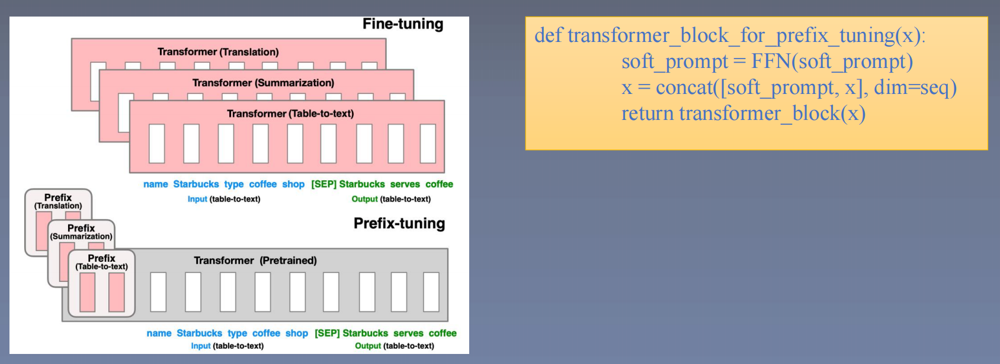
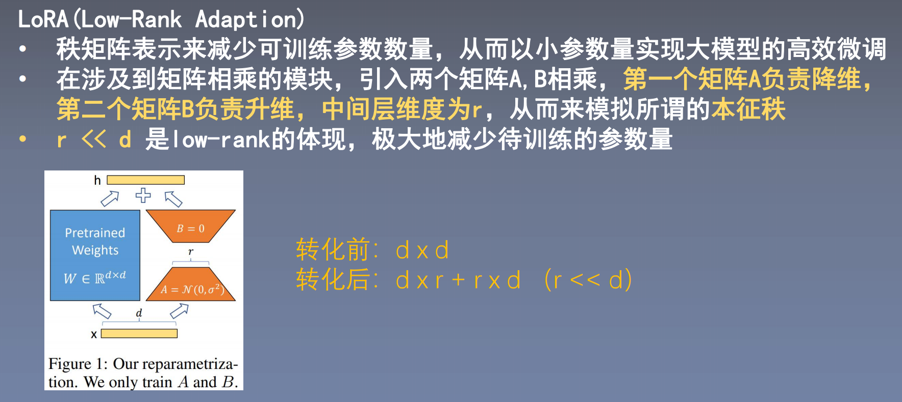

# PEFT笔记

> 当模型不断增大，对**所有**参数进行完全微调不再可行。

**Examples** : see [huggingface-peft-framework](https://github.com/huggingface/peft) .

**PEFT** ——高效参数微调 (parameter efficient fine tune) 

仅微调一小部分的参数(**原来**或**额外**)

## 增量参数微调 

addition-based: 引入额外的参数进行模型微调

### adapter tuning

* (原版)在transformer模块的每个FFN后面都跟着一个adapter层, 只微调adapter层的参数,adapter里面先降维

  

### prompt tuning

>如何设计更好的prompt成了问题,人工设计prompt仿佛回到了机器学习特征工程的时期。

把prompt设计成可训练的参数,通过模型的自动优化让他去寻找一个可训练的最佳的prompt。

如：GPT understands, too(**P-tuning**)

- 随机初始化一些pseudo prompt作为soft prompt, 在输入模型前, 将其与input_ids的embedding concat起来, 一起作为模型的输入。 只微调soft prompt。

### prefix tuning

*   prompt tuning只是对输入层引入了可训练的参数, 而prefix tuning是为**每个**transformer层的输入和隐藏层都拼接可训练参数前缀。---- prompt tuning是prefix tuning的一种简化方式。

## 指定参数微调 

**specification based**: 指定原始模型中的特定的某些参数可调,其余冻结.

*   BitFit--只更新bias(启发式)

## 重参数微调

Reparameterization-based: 将模型中参数**转化**为高效微调的形式。

### LoRA 

Low-Rank Adaption

d * d -> d * r + r * d (r << d)

只是在训练的时候用两个矩阵训练来减少计算参数量；而在inference的时候直接把A B两个矩阵还原回到d * d一个矩阵只做一次运算，inference的性能并没有降低。

AdaLoRA(adaptive lora)

QLoRA
